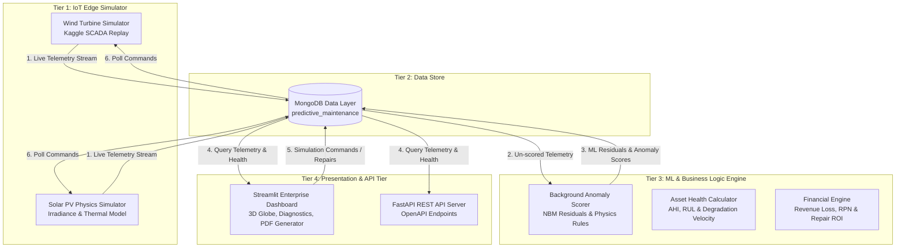
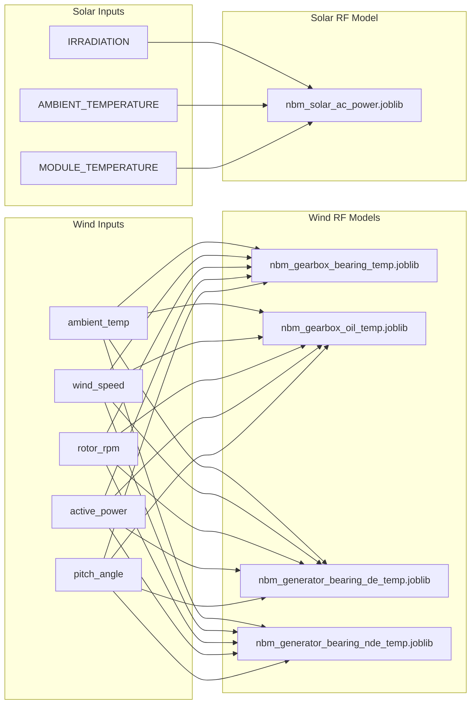
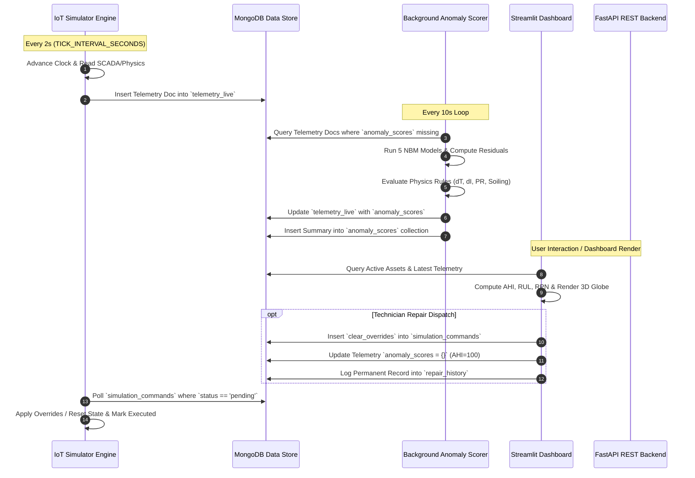

# Renewable Energy Predictive Maintenance (PdM) Platform
## Comprehensive Technical & Architecture Report

---

## Executive Summary

The **Renewable Energy Predictive Maintenance (PdM) Platform** is an enterprise-grade, full-stack predictive maintenance solution designed for hybrid renewable energy fleets (Wind Turbines and Solar PV Arrays). 

The platform ingests high-frequency SCADA telemetry, evaluates machine learning **Normal Behavior Models (NBM)** using Random Forest Regressors, enforces domain-specific **engineering physics & electrical metrics** (Thermal Inertia EMA, Bearing-to-Oil $\Delta T$, 3-Phase Current Imbalance $\Delta I$, IEC 61724 Solar Performance Ratio), estimates **financial downtime & revenue losses**, and provides real-time fleet orchestration via an interactive **Streamlit 3D Globe Dashboard** and a **FastAPI REST Server**.

---

## 1. High-Level Architecture & Tier Breakdown

The system operates across a **4-Tier Decentralized Architecture**:



### System Component Directory Map

| Directory / File | Description |
| :--- | :--- |
| [`config.py`](file:///c:/Users/hitar/Downloads/HackOut/config.py) | Central system configuration, dataset paths, thresholds, pricing, regional modifiers, and SCADA sensor mappings |
| [`simulator/base_asset.py`](file:///c:/Users/hitar/Downloads/HackOut/simulator/base_asset.py) | Base class for assets handling MongoDB persistence, tick counters, override application, and command polling |
| [`simulator/wind_turbine.py`](file:///c:/Users/hitar/Downloads/HackOut/simulator/wind_turbine.py) | SCADA dataset replay engine with exponential thermal inertia smoothing ($\alpha = 0.25$) |
| [`simulator/solar_panel.py`](file:///c:/Users/hitar/Downloads/HackOut/simulator/solar_panel.py) | Solar physics engine (solar geometry, clear-sky irradiance, thermal model, dust soiling accumulation, diode faults) |
| [`simulator/fleet_manager.py`](file:///c:/Users/hitar/Downloads/HackOut/simulator/fleet_manager.py) | Fleet orchestrator, dynamic MongoDB asset auto-discovery worker, and tick loop manager |
| [`simulator/run_simulation.py`](file:///c:/Users/hitar/Downloads/HackOut/simulator/run_simulation.py) | Main launcher CLI for the SCADA telemetry simulator |
| [`ml_engine/train_wind_nbm.py`](file:///c:/Users/hitar/Downloads/HackOut/ml_engine/train_wind_nbm.py) | Trainer for 4 Random Forest Regressors for Wind Turbine thermal baselines |
| [`ml_engine/train_solar_nbm.py`](file:///c:/Users/hitar/Downloads/HackOut/ml_engine/train_solar_nbm.py) | Trainer for Random Forest Regressor for Solar PV AC power generation baseline |
| [`ml_engine/anomaly_scorer.py`](file:///c:/Users/hitar/Downloads/HackOut/ml_engine/anomaly_scorer.py) | Continuous background worker calculating NBM thermal residuals, $\Delta T$, $\Delta I$, PR, and soiling scores |
| [`business_logic/health_index.py`](file:///c:/Users/hitar/Downloads/HackOut/business_logic/health_index.py) | Asset Health Index (AHI 0-100), degradation velocity linear regression slope, and RUL estimation |
| [`business_logic/financial_engine.py`](file:///c:/Users/hitar/Downloads/HackOut/business_logic/financial_engine.py) | Hourly/daily power & revenue loss, Risk Priority Number (RPN), curtailment guards, and repair recommendations |
| [`dashboard/app.py`](file:///c:/Users/hitar/Downloads/HackOut/dashboard/app.py) | 6-tab Streamlit dashboard featuring 3D Globe, deep diagnostics, ReportLab PDF work order generation, and repair workflows |
| [`dashboard/glass_theme.py`](file:///c:/Users/hitar/Downloads/HackOut/dashboard/glass_theme.py) | Enterprise light design system CSS injection and custom UI cards |
| [`backend/api.py`](file:///c:/Users/hitar/Downloads/HackOut/backend/api.py) | FastAPI REST backend exposing OpenAPI endpoints for integration |

---

## 2. Dataset Specifications & Heads

The platform operates on two benchmark renewable energy SCADA datasets downloaded via Kaggle:

### 2.1 Wind Turbine SCADA Dataset
- **Source**: Kaggle (`azizkasimov/wind-turbine-scada-data-for-early-fault-detection`)
- **Structure**: 3 Wind Farms ("Wind Farm A", "Wind Farm B", "Wind Farm C") containing CSV chunks (`comma_0.csv`, `comma_1.csv`, ...).
- **Sampling Frequency**: High-frequency SCADA telemetry.
- **Key Columns & Sensor Mappings (`WIND_SENSOR_MAP` in `config.py`)**:

| Mapped Parameter Name | Source SCADA Column | Description |
| :--- | :--- | :--- |
| `ambient_temp` | `sensor_0_avg` | Ambient outdoor temperature ($^\circ\text{C}$) |
| `wind_direction` | `sensor_1_avg` | Absolute wind direction ($^\circ$) |
| `wind_speed` | `wind_speed_3_avg` | Average wind speed ($\text{m/s}$) |
| `pitch_angle` | `sensor_5_avg` | Blade pitch angle ($^\circ$) |
| `gearbox_bearing_temp` | `sensor_11_avg` | Gearbox main bearing temperature ($^\circ\text{C}$) — **NBM Target** |
| `gearbox_oil_temp` | `sensor_12_avg` | Gearbox sump oil temperature ($^\circ\text{C}$) — **NBM Target** |
| `generator_bearing_de_temp` | `sensor_13_avg` | Generator Drive End (DE) bearing temp ($^\circ\text{C}$) — **NBM Target** |
| `generator_bearing_nde_temp` | `sensor_14_avg` | Generator Non-Drive End (NDE) bearing temp ($^\circ\text{C}$) — **NBM Target** |
| `generator_stator_temp_1..3` | `sensor_15..17_avg` | 3-Phase stator winding temperatures ($^\circ\text{C}$) |
| `generator_rpm` | `sensor_18_avg` | Generator shaft rotational speed ($\text{RPM}$) |
| `rotor_rpm` | `sensor_52_avg` | Rotor shaft rotational speed ($\text{RPM}$) |
| `current_phase_1..3` | `sensor_23..25_avg` | 3-Phase stator current output ($\text{A}$) |
| `grid_frequency` | `sensor_26_avg` | Grid frequency ($\text{Hz}$) |
| `active_power` | `power_29_avg` | Active electrical power output ($\text{kW}$) |
| `status_type_id` | `status_type_id` | Operation status code (0 = Normal, 1 = Derated, 2 = Idling) |

#### Sample Dataset Head (`comma_0.csv`)
```csv
time_stamp,sensor_0_avg,wind_speed_3_avg,sensor_5_avg,sensor_11_avg,sensor_12_avg,sensor_13_avg,sensor_14_avg,sensor_18_avg,power_29_avg,status_type_id,train_test
2018-01-01 00:00:00,12.4,7.85,0.12,54.2,48.1,62.3,58.7,1480.2,1250.4,0,train
2018-01-01 00:10:00,12.5,8.10,0.15,55.1,48.5,63.1,59.2,1510.8,1310.8,0,train
```

---

### 2.2 Solar PV Generation & Weather Dataset
- **Source**: Kaggle (`anikannal/solar-power-generation-data`)
- **Files**: `Plant_1_Generation_Data.csv` & `Plant_1_Weather_Sensor_Data.csv`
- **Merging Key**: Inner join on `DATE_TIME`

| Dataset Parameter | Description | Unit |
| :--- | :--- | :--- |
| `IRRADIATION` / `solar_irradiance` | Solar Global Horizontal Irradiance (GHI) | $\text{W/m}^2$ |
| `AMBIENT_TEMPERATURE` / `ambient_temp` | Ambient air temperature | $^\circ\text{C}$ |
| `MODULE_TEMPERATURE` / `panel_temp` | Solar PV module surface temperature | $^\circ\text{C}$ |
| `AC_POWER` / `power_output_kw` | Inverter AC power output | $\text{kW}$ |

#### Sample Merged Dataset Head
```csv
DATE_TIME,PLANT_ID,SOURCE_KEY,DC_POWER,AC_POWER,DAILY_YIELD,AMBIENT_TEMPERATURE,MODULE_TEMPERATURE,IRRADIATION
2020-05-15 06:00:00,4135001,1BYsWBLy74yFocus,0.0,0.0,0.0,25.18,25.18,0.00
2020-05-15 07:00:00,4135001,1BYsWBLy74yFocus,1413.75,138.44,40.0,27.12,32.45,0.21
```

---

## 3. Global System Parameters & Configuration (`config.py`)

The platform relies on strict physical, financial, and database parameters defined in [`config.py`](file:///c:/Users/hitar/Downloads/HackOut/config.py):

### 3.1 Platform Operational & Financial Constants
- `MONGO_URI`: `mongodb://localhost:27017/`
- `DB_NAME`: `predictive_maintenance`
- `COLLECTION_TELEMETRY`: `telemetry_live`
- `COLLECTION_COMMANDS`: `simulation_commands`
- `COLLECTION_ASSETS`: `assets`
- `COLLECTION_ANOMALY_SCORES`: `anomaly_scores`
- `COLLECTION_REPAIR_HISTORY`: `repair_history`
- `TICK_INTERVAL_SECONDS`: `2` seconds (Real-world simulation execution speed)
- `ELECTRICITY_PRICE_PER_KWH`: `$0.10` USD
- `EMERGENCY_REPLACEMENT_COST`: `$50,000` USD (Failure Imminent / Catastrophic Component Replacement)
- `PREVENTIVE_MAINTENANCE_COST`: `$5,000` USD (Scheduled Preventive Servicing)
- `WIND_TURBINE_CAPACITY_KW`: `2000` kW ($2.0\text{ MW}$)
- `SOLAR_PANEL_CAPACITY_KW`: `10` kW per panel array

---

### 3.2 Supply Chain Procurement Lead Times
Used to compute the Risk Priority Number (RPN) based on component replacement lead times:

| Fault / Component Target | Supply Chain Lead Time (Days) | Logistic Complexity Rationale |
| :--- | :---: | :--- |
| `gearbox_bearing_temp` | **60 Days** | Heavy-lift offshore vessel / 500-ton crane requirement |
| `gearbox_oil_temp` | **45 Days** | High-pressure filtration & gearbox oil flush supply |
| `generator_bearing_de_temp` | **21 Days** | Drive-end bearing alignment & shaft pull |
| `generator_bearing_nde_temp` | **21 Days** | Non-drive-end bearing replacement |
| `vibration` | **30 Days** | Rotor rebalancing & blade pitch actuator overhaul |
| `electrical_imbalance` | **14 Days** | Stator winding rewiring & transformer tap repair |
| `inverter` | **5 Days** | Power electronics inverter module swap |
| `power_deficit` | **3 Days** | Combiner box inspection & cabling repair |
| `diode` | **2 Days** | Bypass diode soldering / module junction box replacement |
| `soiling` | **1 Day** | Automated robot / washing crew dispatch |

---

### 3.3 Regional Climate Modifiers & OEM Hardware Registry
Applies climate offsets, dust factors, GPS coordinates, and OEM specs across 4 distinct regions:

```python
REGIONAL_MODIFIERS = {
    'Desert': {
        'temp_offset': 10, 'humidity': 20, 'dust_factor': 1.5, 'wind_factor': 1.1,
        'lat': 26.9124, 'lon': 70.9023,
        'oem_wind': 'Siemens Gamesa SG 3.4-132', 'oem_solar': 'FirstSolar Series 6 Plus'
    },
    'Nordic': {
        'temp_offset': -15, 'humidity': 40, 'dust_factor': 0.2, 'wind_factor': 1.2,
        'lat': 62.1983, 'lon': 15.0414,
        'oem_wind': 'Vestas V117-4.2MW EnVentus', 'oem_solar': 'REC Alpha Pure-R'
    },
    'Coastal': {
        'temp_offset': 2, 'humidity': 80, 'dust_factor': 0.5, 'wind_factor': 1.5,
        'lat': 21.6417, 'lon': 69.6293,
        'oem_wind': 'MHI Vestas V164 Offshore', 'oem_solar': 'SunPower Maxeon 6'
    },
    'Temperate': {
        'temp_offset': 0, 'humidity': 50, 'dust_factor': 1.0, 'wind_factor': 1.0,
        'lat': 51.1657, 'lon': 10.4515,
        'oem_wind': 'GE 2.8-127 Sierra', 'oem_solar': 'Canadian Solar HiKu7'
    }
}
```

---

## 4. Machine Learning Models: Features, Parameters & Usage

The system deploys **5 Machine Learning Models** trained using `scikit-learn`'s `RandomForestRegressor` and saved via `joblib`.



### 4.1 Model Specifications Summary Table

| Model Target / Name | Model Type | Feature Inputs | Hyperparameters | Target Units | Training Sample Filter | Validation Metrics | File Artifact |
| :--- | :--- | :--- | :--- | :--- | :--- | :--- | :--- |
| **Gearbox Bearing Temp** | `RandomForestRegressor` | `ambient_temp`, `wind_speed`, `rotor_rpm`, `active_power`, `pitch_angle` | `n_estimators=20`<br/>`max_depth=12`<br/>`random_state=42`<br/>`n_jobs=-1` | Temperature ($^\circ\text{C}$) | Normal operational state (`status_type_id == 0` & `train_test == 'train'`) | MAE: ~0.8-1.2 $^\circ\text{C}$<br/>$R^2 > 0.94$ | `models/nbm_gearbox_bearing_temp.joblib` |
| **Gearbox Oil Temp** | `RandomForestRegressor` | `ambient_temp`, `wind_speed`, `rotor_rpm`, `active_power`, `pitch_angle` | `n_estimators=20`<br/>`max_depth=12`<br/>`random_state=42`<br/>`n_jobs=-1` | Temperature ($^\circ\text{C}$) | Normal operational state (`status_type_id == 0` & `train_test == 'train'`) | MAE: ~0.6-0.9 $^\circ\text{C}$<br/>$R^2 > 0.96$ | `models/nbm_gearbox_oil_temp.joblib` |
| **Gen Bearing DE Temp** | `RandomForestRegressor` | `ambient_temp`, `wind_speed`, `rotor_rpm`, `active_power`, `pitch_angle` | `n_estimators=20`<br/>`max_depth=12`<br/>`random_state=42`<br/>`n_jobs=-1` | Temperature ($^\circ\text{C}$) | Normal operational state (`status_type_id == 0` & `train_test == 'train'`) | MAE: ~0.9-1.4 $^\circ\text{C}$<br/>$R^2 > 0.93$ | `models/nbm_generator_bearing_de_temp.joblib` |
| **Gen Bearing NDE Temp** | `RandomForestRegressor` | `ambient_temp`, `wind_speed`, `rotor_rpm`, `active_power`, `pitch_angle` | `n_estimators=20`<br/>`max_depth=12`<br/>`random_state=42`<br/>`n_jobs=-1` | Temperature ($^\circ\text{C}$) | Normal operational state (`status_type_id == 0` & `train_test == 'train'`) | MAE: ~0.8-1.3 $^\circ\text{C}$<br/>$R^2 > 0.93$ | `models/nbm_generator_bearing_nde_temp.joblib` |
| **Solar AC Power Output** | `RandomForestRegressor` | `IRRADIATION`, `AMBIENT_TEMPERATURE`, `MODULE_TEMPERATURE` | `n_estimators=20`<br/>`max_depth=12`<br/>`random_state=42`<br/>`n_jobs=-1` | AC Power Output ($\text{kW}$) | Daytime observations (`IRRADIATION > 0.05`) | MAE: ~1.5-2.2 $\text{kW}$<br/>$R^2 > 0.98$ | `models/nbm_solar_ac_power.joblib` |

---

### 4.2 Model Inference & Thermal Residual Anomaly Scoring Engine

In real time, the continuous background worker [`ml_engine/anomaly_scorer.py`](file:///c:/Users/hitar/Downloads/HackOut/ml_engine/anomaly_scorer.py) processes incoming MongoDB SCADA telemetry documents:

#### 1. Residual Calculation
$$\text{Residual}_i = |\text{Actual}_i - \widehat{\text{Predicted}}_i|$$

#### 2. Component Anomaly Score Formula
Component thresholds are calibrated with a warning limit of $5.0^\circ\text{C}$ and a critical limit of $10.0^\circ\text{C}$:
$$\text{Score}_i = \min\left(100.0, \frac{\text{Residual}_i}{\text{Critical Threshold}} \times 100.0\right)$$

#### 3. Solar Inverter Clipping Guard & Power Deficit Threshold
For solar panels, predicted AC power is capped by the inverter ceiling capacity ($\text{Capacity}_{\text{kw}}$):
$$\widehat{P}_{\text{expected}} = \min(\text{Model.predict}(X), \text{Capacity}_{\text{kw}})$$

To prevent false alarms caused by cloud transients, power deficit scoring is only triggered when actual power drops below **85%** of the expected ML baseline:
$$\text{Power Anomaly} = \begin{cases} \min\left(100.0, \frac{\widehat{P}_{\text{expected}} - P_{\text{actual}}}{\widehat{P}_{\text{expected}}} \times 100\right) & \text{if } P_{\text{actual}} < 0.85 \times \widehat{P}_{\text{expected}} \\ 0.0 & \text{otherwise} \end{cases}$$

---

## 5. Engineering Physics, Electrical & Business Logic Engines

The platform goes beyond pure machine learning by integrating explicit domain physics equations and financial algorithms.

### 5.1 Physics & Electrical Diagnostic Rules

#### 1. Exponential Thermal Inertia Smoothing (EMA Filter)
Simulates thermal mass inertia in mechanical nacelle housing to prevent high-frequency thermal jitter:
$$T_{\text{smoothed}}^{(t)} = \alpha \cdot (T_{\text{raw}}^{(t)} + \text{Temp Offset}) + (1 - \alpha) \cdot T_{\text{smoothed}}^{(t-1)} \quad \text{where } \alpha = 0.25$$

#### 2. Bearing-to-Oil Differential Temperature ($\Delta T$)
Detects localized mechanical friction or oil channel blockages:
$$\Delta T = T_{\text{gearbox\_bearing}} - T_{\text{gearbox\_oil}}$$
- **Normal Range**: $10^\circ\text{C} \le \Delta T \le 15^\circ\text{C}$
- **Fault Flag**: Spikes above $20.0^\circ\text{C}$ trigger severe friction anomaly scores:
$$\text{Score}_{\text{thermal\_delta}} = \min(100.0, (\Delta T - 20.0) \times 5.0)$$

#### 3. 3-Phase Electrical Current Imbalance ($\Delta I$)
Monitors stator winding electrical health across Phase 1, Phase 2, and Phase 3:
$$I_{\text{avg}} = \frac{I_1 + I_2 + I_3}{3}$$
$$\Delta I\% = \left(\frac{\max(|I_1 - I_{\text{avg}}|, |I_2 - I_{\text{avg}}|, |I_3 - I_{\text{avg}}|)}{I_{\text{avg}}}\right) \times 100$$
- **Alarm Threshold**: Imbalance $> 5.0\%$ triggers electrical anomaly score:
$$\text{Score}_{\text{electrical}} = \min(100.0, (\Delta I\% - 5.0) \times 10.0)$$

#### 4. IEC 61724 Solar Performance Ratio (PR)
Measures solar array efficiency normalized against solar irradiance:
$$PR = \frac{P_{\text{actual}}}{\left(\frac{\text{Irradiance}}{1000}\right) \times \text{Capacity}_{\text{kw}}}$$
- **Threshold**: $PR < 0.70$ flags soiling or diode failure:
$$\text{Score}_{PR} = \min(100.0, (0.80 - PR) \times 250.0)$$

---

### 5.2 Asset Health Index (AHI) & Degradation Velocity ($RUL$)

#### 1. Asset Health Index (AHI 0-100)
$$\text{AHI} = \max(0.0, \min(100.0, 100.0 - \text{Overall Anomaly Score}))$$

| AHI Range | Health Classification | UI Color Code | Action Required |
| :---: | :---: | :---: | :--- |
| **80 - 100** | Healthy | `#10b981` (Green) | Normal operations |
| **50 - 79** | Warning | `#f59e0b` (Yellow) | Inspect during next maintenance cycle |
| **20 - 49** | Critical | `#ef4444` (Orange) | Schedule repair within 7 days |
| **0 - 19** | Failure Imminent | `#991b1b` (Red) | Immediate emergency shutdown/repair |

#### 2. Degradation Velocity & Remaining Useful Life (RUL Hours)
Determined via 1st-degree linear regression polynomial fit ($\text{polyfit}$) over historical anomaly scores:
$$\text{Rate} = \frac{d(\text{Anomaly Score})}{d(\text{Hours})}$$
$$\text{RUL (Operating Hours)} = \max\left(0.5, \min\left(720.0, \frac{\text{AHI}}{|\text{Rate}|}\right)\right)$$
- **Rapid Collapse Alert**: Triggered if AHI degradation velocity $> 5.0\text{ AHI points/hour}$ or $RUL < 24\text{ hours}$.

---

### 5.3 Financial Risk Engine & Priority Scoring

#### 1. Grid Curtailment Guard
Prevents false revenue loss metrics when a turbine is intentionally throttled by grid operators:
$$\text{Hourly Power Loss (kW)} = \begin{cases} 0.0 & \text{if } \text{status\_type\_id} \in [1, 2] \text{ and } \text{AHI} \ge 80.0 \\ \max(0.0, P_{\text{expected}} - P_{\text{actual}}) & \text{otherwise} \end{cases}$$

#### 2. Daily Revenue Loss Estimation
$$\text{Revenue Loss}_{\text{daily}} = \text{Power Loss (kW)} \times 24\text{ Hours} \times \$0.10/\text{kWh}$$

#### 3. Risk Priority Number (RPN)
Combines component failure probability, daily revenue loss, and supply chain lead time risk:
$$\text{RPN} = \frac{(100.0 - \text{AHI}) \times \text{Revenue Loss}_{\text{daily}} \times \left(1 + \frac{\text{Lead Time (Days)}}{30}\right)}{100.0}$$

---

## 6. End-to-End Data Flow

The sequential flow of a single telemetry record through the platform:



---

## 7. IoT Simulator Mechanics & Simulation Timings

The IoT Edge Simulator [`simulator/fleet_manager.py`](file:///c:/Users/hitar/Downloads/HackOut/simulator/fleet_manager.py) manages fleet execution:

### 7.1 What We Simulate

#### 1. Wind Turbines ([`simulator/wind_turbine.py`](file:///c:/Users/hitar/Downloads/HackOut/simulator/wind_turbine.py))
- **SCADA Data Stream Replay**: Replays real SCADA CSV rows from Kaggle datasets chunk-by-chunk.
- **Thermal Mass Inertia**: Applies exponential moving average ($\alpha = 0.25$) on nacelle, bearing, and oil temperatures.
- **Fault Injection Support**: Accepts dynamic thermal overrides (e.g. $+25^\circ\text{C}$ bearing spike).

#### 2. Solar PV Arrays ([`simulator/solar_panel.py`](file:///c:/Users/hitar/Downloads/HackOut/simulator/solar_panel.py))
- **Solar Geometry Physics Model**: Calculates solar declination, hour angle, and altitude angle based on GPS latitude to generate realistic clear-sky irradiance:
$$\sin(\alpha) = \sin(\text{lat}) \cdot \sin(\delta) + \cos(\text{lat}) \cdot \cos(\delta) \cdot \cos(\omega)$$
$$\text{Irradiance}_{\text{clear}} = 1000 \cdot \sin(\alpha) \cdot (1 - 0.75 \cdot \text{Cloud Cover})$$
- **Nominal Operating Cell Temperature (NOCT = $45^\circ\text{C}$)**:
$$T_{\text{panel}} = T_{\text{ambient}} + (45 - 20) \times \frac{\text{Irradiance}}{800}$$
- **Dust Soiling Accumulation**: Soiling factor degrades continuously by `soiling_rate` ($0.001/\text{tick}$) modified by regional dust factors ($1.5\times$ in Desert).
- **Blown Bypass Diode Faults**: Simulates junction box diode failure causing an immediate **33%** power generation loss.

---

### 7.2 Simulation Timing Parameters

| Simulation Dimension | Parameter | Value / Metric | Description |
| :--- | :--- | :---: | :--- |
| **Real-World Execution Speed** | `TICK_INTERVAL_SECONDS` | **`2` Seconds** | Delay between simulation ticks (`time.sleep(2)`) |
| **Simulated Solar Clock Advancement** | `sim_time` Delta | **`10` Minutes / Tick** | Each tick advances the internal solar clock by 10 minutes (`sim_time += timedelta(minutes=10)`) |
| **Auto-Discovery Loop Frequency** | `_discover_new_assets()` | **Every `5` Ticks** | Simulator polls MongoDB for new `pending` assets every 10 seconds |
| **Background Anomaly Scorer Poll** | `run_scoring_loop()` | **`10` Seconds** | Polling loop interval for un-scored telemetry records |
| **Dashboard Auto-Refresh Option** | `refresh_interval` | **`3 - 30` Seconds** | Configurable Streamlit UI live auto-refresh rate |

---

## 8. Dashboard & Application Deliverables

The presentation tier contains two core deliverables:

### 8.1 Streamlit Enterprise Dashboard ([`dashboard/app.py`](file:///c:/Users/hitar/Downloads/HackOut/dashboard/app.py))
Consists of 6 dedicated application tabs:

1. **Fleet Overview**: Top-level fleet KPIs, **Interactive 3D Globe Map** (Orthographic / Flat Map with asset focus zoom & regional legend), and summary asset tables.
2. **Asset Deep Dive**: Asset Health Index (AHI) trend plots, component temperature charts, bearing-to-oil $\Delta T$, 3-phase current imbalance $\Delta I$, and solar actual vs. ML baseline power curves.
3. **Maintenance Queue**: Prioritized maintenance queue by Risk Priority Number (RPN), **ReportLab PDF Work Order Generator**, and **1-Click Repair Command Dispatcher** with permanent MongoDB logging to `repair_history`.
4. **Financial Impact**: Daily revenue loss bar charts, climate region loss distribution pie charts, 30-day cost of inaction metrics, and preventive maintenance ROI analysis.
5. **Asset Manager**: Dynamic provisioning form allowing technicians to add new wind turbines and solar panels with latched fault conditions (overheated gearbox, critical generator bearing, blown diode, heavy dust soiling).
6. **Command Center**: Real-time operational control panel to dispatch sensor overrides, trigger panel wash cycles, or execute emergency stops.

---

### 8.2 FastAPI REST Backend Server ([`backend/api.py`](file:///c:/Users/hitar/Downloads/HackOut/backend/api.py))
Exposes production OpenAPI / RESTful endpoints running on `http://localhost:8000`:

| HTTP Method | API Endpoint | Functionality |
| :---: | :--- | :--- |
| `GET` | `/` | Root health check & API version metadata |
| `GET` | `/api/fleet/summary` | Top-level fleet metrics (healthy vs. at-risk counts, total daily loss) |
| `GET` | `/api/assets` | Query registered assets with `asset_type` & `region` filtering |
| `POST` | `/api/assets` | Register a new asset into MongoDB for simulator auto-discovery |
| `GET` | `/api/telemetry/{asset_id}` | Retrieve historical telemetry records for a specific equipment unit |
| `GET` | `/api/maintenance/queue` | Fetch prioritized maintenance queue sorted by Risk Priority Number (RPN) |
| `POST` | `/api/commands` | Dispatch live override, fault injection, or repair commands |

---

## 9. Verification & Execution Guide

To launch and run the entire platform:

### Step 1: Start MongoDB
Ensure MongoDB is active on `mongodb://localhost:27017`.

### Step 2: (Optional) Train ML Models
```bash
python -m ml_engine.train_wind_nbm
python -m ml_engine.train_solar_nbm
```

### Step 3: Launch IoT Simulator Engine (Terminal 1)
```bash
python simulator/run_simulation.py --seed-defaults
```

### Step 4: Launch Background Anomaly Scorer (Terminal 2)
```bash
python -m ml_engine.anomaly_scorer
```

### Step 5: Launch Streamlit Enterprise Dashboard (Terminal 3)
```bash
streamlit run dashboard/app.py
```
*Access UI at: **`http://localhost:8501`***

### Step 6: Launch FastAPI REST API Server (Terminal 4 - Optional)
```bash
python backend/api.py
```
*Access API Swagger docs at: **`http://localhost:8000/docs`***

---
*Report generated automatically for the Renewable Energy Predictive Maintenance Platform.*
