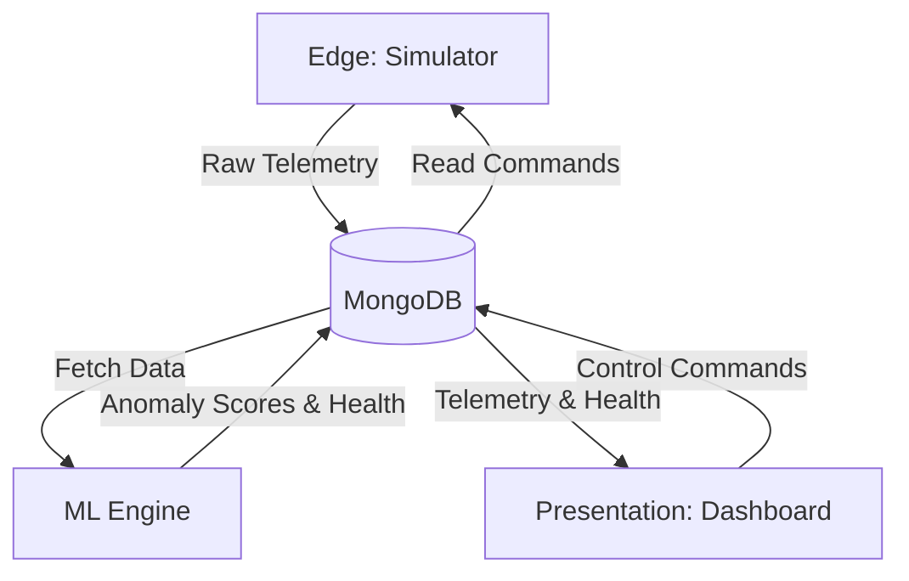

# System Architecture

The Predictive Maintenance Platform is composed of four main tiers:

1. **Edge (Simulator)**: Simulates wind turbine sensor telemetry and pushes to the Data tier.
2. **Data (MongoDB)**: Stores live telemetry, asset metadata, command instructions, and anomaly scores.
3. **ML Compute**: Reads recent data, applies Normal Behavior Modeling (NBM), calculates residuals, and generates anomaly scores.
4. **Presentation (Dashboard)**: Streamlit-based UI to view live telemetry, health index, and financial metrics.

