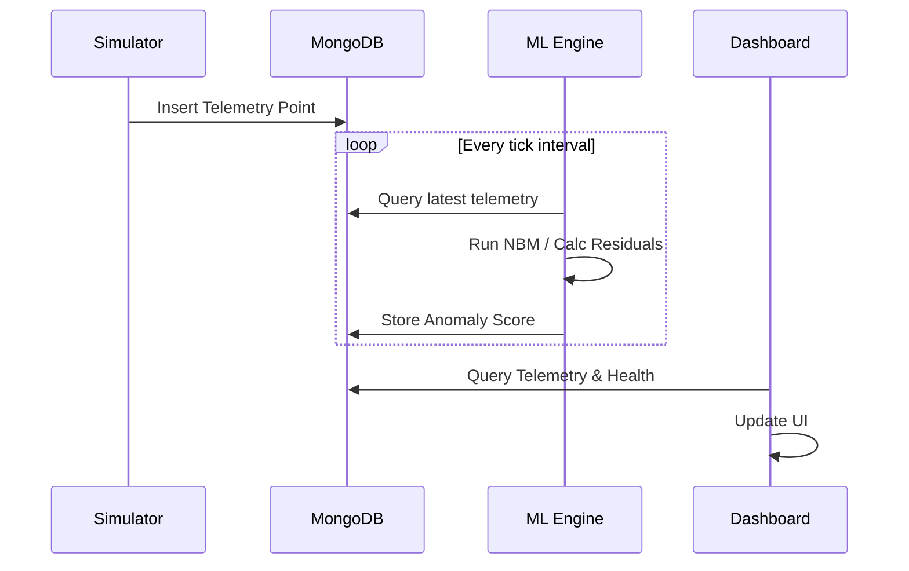

# Data Flow

How a single data point travels through the Predictive Maintenance Platform:

```mermaid
sequenceDiagram
    participant Sim as Simulator
    participant DB as MongoDB
    participant ML as ML Engine
    participant Dash as Dashboard

    Sim->>DB: Insert Telemetry Point
    loop Every tick interval
        ML->>DB: Query latest telemetry
        ML->>ML: Run NBM / Calc Residuals
        ML->>DB: Store Anomaly Score
    end
    Dash->>DB: Query Telemetry & Health
    Dash->>Dash: Update UI
```
